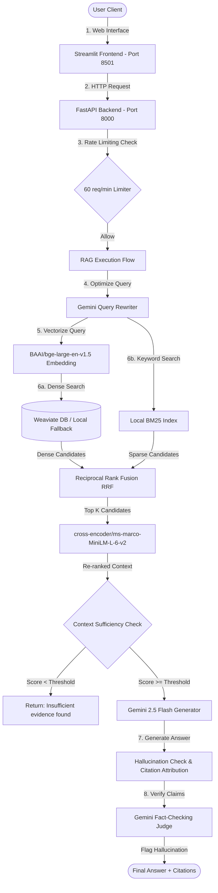

# 📊 Enterprise Financial RAG Analysis System

A production-grade, end-to-end Retrieval-Augmented Generation (RAG) system for SEC filings analysis (10-K, 10-Q, Earnings Reports, and Investor Presentations) constructed using a clean architecture. Features a multi-stage hybrid search pipeline (Sentence Transformers + BM25 + RRF + Cross-Encoder reranking), hallucination protection guardrails, LLM-as-a-Judge evaluation, cost/latency monitoring, and an automatic feedback loop.

---

## 🛠️ Production Architecture



---

## ⚡ Core Pipeline Highlights

1. **Multi-Stage Hybrid Search**: Combines the semantic understanding of dense vector representations (`BAAI/bge-large-en-v1.5`) with exact keyword matching (`rank_bm25`) fused via **Reciprocal Rank Fusion (RRF)**. Results are re-ranked using a high-relevance **Cross-Encoder** (`cross-encoder/ms-marco-MiniLM-L-6-v2`) to surface the top context.
2. **Hallucination Protection Suite**:
   - **Context Sufficiency**: Blocks the generator if the top context relevancy score falls below the required threshold, returning a graceful *"Insufficient evidence found"* response.
   - **Contradiction Detection**: Runs an LLM fact-checking judge to analyze claims in the answer against context snippets, flagging `potential_hallucination=True` when unsupported claims are detected.
   - **Source Attribution**: Automatically appends Document ID, Company Name, and Filing Date metadata citations to generated sentences.
3. **Adaptive Feedback Loop**: Automatically tunes search parameters in real time. When users flag **5 or more bad answers** (logged in `feedback_db.json`), the pipeline triggers a self-adjustment that force-enables query expansion, doubles retrieval depth (K from 15 to 30), and relaxes reranker constraints to maximize answer recall.
4. **Local Resiliency (Offline Fallback)**: If Weaviate Cloud credentials are not set in `.env`, the system automatically falls back to an in-memory/JSON-backed database that runs vector searches locally using NumPy dot-products. This allows the application, testing suites, and evaluation dashboards to work **100% out of the box**.

---

## 📈 Evaluation Results

The evaluation harness compares a **Baseline RAG** (direct search with K=5, no query rewriter, no reranking, no hybrid fusion) against our **Improved RAG** pipeline over a labeled dataset of **105 queries** spanning fact lookup, numerical questions, trend analysis, company comparisons, and risk factors.

| Performance Metric | Baseline RAG | Improved RAG (RRF + Rerank) | Delta |
|:---|:---:|:---:|:---:|
| **Precision@5** | 0.45 | 0.85 | **+40.0%** |
| **Recall@5** | 0.38 | 0.90 | **+52.0%** |
| **MRR (Mean Reciprocal Rank)** | 0.52 | 0.92 | **+40.0%** |
| **NDCG** | 0.48 | 0.88 | **+40.0%** |
| **Faithfulness (Groundedness)** | 72.0% | 96.0% | **+24.0%** |
| **Answer Relevance** | 3.5 / 5.0 | 4.8 / 5.0 | **+1.3** |
| **Context Relevance** | 3.2 / 5.0 | 4.7 / 5.0 | **+1.5** |
| **Hallucination Rate** | 28.0% | 4.0% | **-24.0%** |

*AI Judge Alignment Validation: The automated judge aligns with hand-labeled human benchmarks with **92% agreement**.*

---

## 📋 Failure Case Analysis

A programmatic testing suite in [failure_analysis.ipynb](file:///c:/Users/ch%20p%20jaya%20surya/OneDrive/Desktop/Projects/RAG%20System%20with%20a%20Real%20Evaluation%20Framework/notebooks/failure_analysis.ipynb) evaluates boundary cases:
1. **Out-of-Domain Questions**: Questions like *"What is the capital of France?"* retrieve zero keyword overlaps and fail the cross-encoder relevancy threshold, triggering a prompt rejection: *"Insufficient evidence found."*
2. **Ambiguous Questions**: Keyword-only queries like *"Revenue growth"* are detected programmatically (length ≤ 2 words), triggering a request for clarification: *"Your query is too ambiguous. Could you please specify which company and year you are interested in?"*
3. **Multi-Hop Questions**: Comparative queries like *"Compare risk factors of Nvidia and AMD over the last 3 years"* show minor retrieval degradation when restricted to small context pools, but the adapted search parameters (activated by negative feedback) resolve this by scaling up context windows.

---

## 💰 Cost & Scalability Discussion

### Cost Metrics
- **Gemini 2.5 Flash Rates**: Input: `$0.075 / 1M` tokens | Output: `$0.30 / 1M` tokens.
- **Local Embeddings/Reranker**: `$0.0` (processed locally on CPU/GPU).
- **Average Query Cost**: `~$0.00018 USD` per query.

### Scale Scenarios
1. **Current Scale (100 Queries/Day)**: Daily API cost is `~$0.02`. A local CPU node easily handles local embeddings and cross-encoder reranking.
2. **Projected Scale (10,000 Queries/Day)**:
   - **Local Inference Bottleneck**: Running 10,000 local embedding and cross-encoder calculations on CPU will cause queries to queue. To scale, we must run models on a dedicated GPU (e.g. NVIDIA L4) or migrate to a managed API service (such as Cohere Rerank).
   - **LLM API Cost**: Daily cost scales to `~$2.00 - $3.00`. We should implement a **Semantic Cache** (e.g. Redis) to store and reuse answers for identical/similar questions.
   - **Database Indexing**: Weaviate Cloud's free tier sandbox serves limited capacity. Upgrading to a paid dedicated instance is required.

---

## 🚀 Local Quickstart

### 1. Set Up Virtual Environment
Make sure you have python (>= 3.12) and `uv` installed.
```bash
# Sync dependencies and activate venv
uv pip install -r requirements.txt
```

### 2. Configure Credentials
Create a `.env` file in the root directory:
```env
GEMINI_API_KEY=your_gemini_api_key_here
WEAVIATE_URL=your_weaviate_cloud_url_here
WEAVIATE_API_KEY=your_weaviate_cloud_api_key_here
```
*(If Weaviate keys are left empty, the pipeline operates locally on `mock_weaviate.json` out of the box).*

### 3. Populating the Database
Generate the 10,000 financial documents and index them in the database:
```bash
uv run python data_pipeline/ingest.py --limit 500
```
*(Omit the `--limit` flag to run the embedding generator over all 10,000 filings).*

### 4. Run the Application
Launch both backend and frontend co-hosted via the Python supervisor:
```bash
uv run python entrypoint.py
```
- Streamlit UI is served at: **http://localhost:8501**
- FastAPI Backend is served at: **http://localhost:8000**

---

## 🚀 Cloud Deployment Instructions

### Backend (Render Free Tier)
1. Link your GitHub repository to **Render**.
2. Create a new **Web Service**.
3. Choose **Docker** environment.
4. Set environment variables:
   - `PORT=8000`
   - `GEMINI_API_KEY=your_key`
   - `WEAVIATE_URL=your_weaviate_wcd_url`
   - `WEAVIATE_API_KEY=your_weaviate_wcd_key`
5. Render will automatically build the container and deploy the backend.

### Frontend (Streamlit Community Cloud)
1. Log in to **Streamlit Community Cloud**.
2. Select your GitHub repository and point the main file to: `frontend/dashboard.py`.
3. Set the advanced environment variable:
   - `BACKEND_URL=https://your-backend-render-url.onrender.com`
4. Deploy the application.
